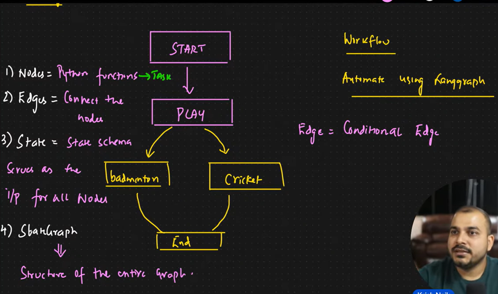

# AI Agents vs Agentic Systems

| AI Agent                          | Agentic System                                               |
| --------------------------------- | ------------------------------------------------------------ |
| A single autonomous AI unit       | A complete ecosystem of agents and workflows                 |
| Handles one goal/task             | Handles complex multi-step operations                        |
| Uses reasoning, memory, and tools | Coordinates multiple agents, tools, memory, APIs, and humans |
| Like one employee                 | Like an entire company                                       |
| Example: Coding assistant agent   | Example: Full autonomous software development platform       |

