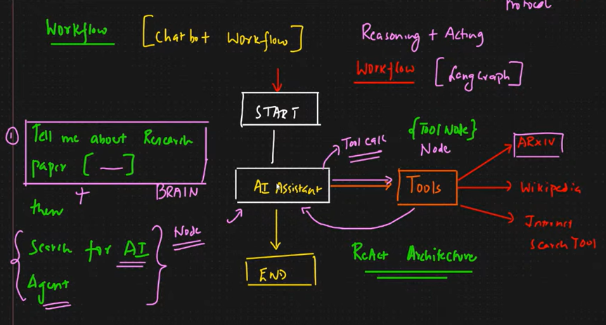

# ReAct in GenAI

**ReAct = Reason + Act**

A framework where an AI model:

1. Reasons step-by-step
2. Takes actions using tools/APIs
3. Observes results
4. Gives the final answer

## Flow

Question → Thought → Action → Observation → Final Answer

## Benefits

- Better reasoning
- Tool usage support
- Reduced hallucinations
- Multi-step problem solving

## Example

User: "What's the weather in Delhi?"

AI:

- Thought: Need weather data
- Action: Call weather API
- Observation: Rain expected
- Final Answer: Carry an umbrella
