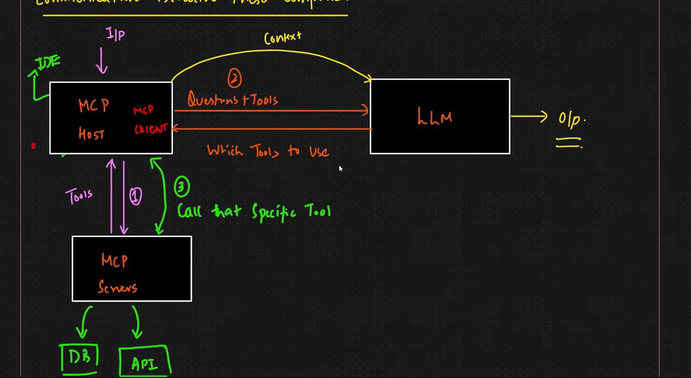
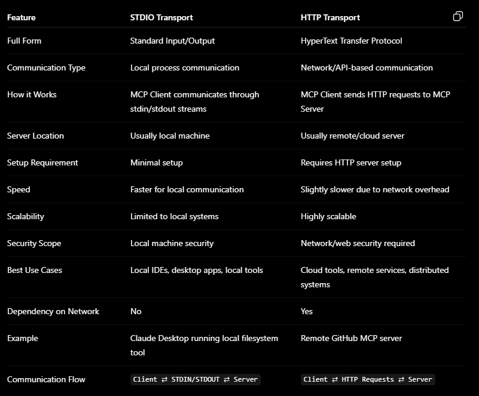

MCP stands for **Model Context Protocol**, which is an open standard used to connect AI models with external tools, APIs, databases, and services in a standardized way. It removes the need for custom integrations for every tool and allows plug-and-play communication between AI systems and external resources.

The **MCP Host** is the main AI application that the user interacts with, such as Claude Desktop, an AI IDE, or an AI agent application. Inside the host, there is an **MCP Client**, which is responsible for communicating with MCP servers using the MCP protocol.

The MCP client acts like a connector or communication layer. It:

- sends requests from the AI application
- discovers available tools
- handles structured messages
- manages request/response flow
- communicates with MCP servers over protocols like stdio, HTTP, or WebSockets

MCP clients are usually created inside the host application using MCP SDKs or libraries provided by the framework. For example, an AI application can initialize an MCP client and configure it to connect with one or multiple MCP servers.

The **MCP Server** exposes tools or resources like GitHub, databases, file systems, browsers, or APIs that the AI can use. The server receives requests from the MCP client, executes the required operation, and returns structured responses back to the AI application.

Overall flow is:

```text id="7y6kdm"
User → MCP Host → MCP Client → MCP Server → External Tool/API
```

So MCP standardizes communication between AI systems and external services, making tool integration modular, reusable, and scalable.

**what happens to the integration if there is any update in tools**
One of the major advantages of MCP is that integrations become more stable and modular even when tools get updated.

If a tool or external service changes internally, the AI application usually does not need major changes as long as the MCP server still follows the same MCP protocol and schema. The MCP client communicates through standardized interfaces, so the host remains decoupled from tool implementation details.

For example:

- if a GitHub MCP server updates its internal API logic,
- but still exposes the same MCP-compatible tool schema,

then the AI host and MCP client continue working normally without breaking the integration.

Only when:

- tool schemas change,
- endpoints change significantly,
- authentication methods change,
- or protocol compatibility breaks,

might the MCP client or host require updates.

So MCP reduces integration fragility by introducing a standardized communication layer between AI systems and external tools.

**Entire Communication process**


1. User sends query to MCP Host.
2. MCP Client discovers available tools from MCP Servers.
3. MCP Host sends user query and tool descriptions to the LLM.
4. LLM decides which tool should be used.
5. MCP Client calls the selected MCP Server/tool.
6. MCP Server fetches required data/context from APIs, DBs, files, etc.
7. MCP Server returns the fetched context/tool output to the MCP Host.
8. MCP Host sends the retrieved context back to the LLM.
9. LLM generates the final response for the user.

- **Difference between stdio and http**
  
