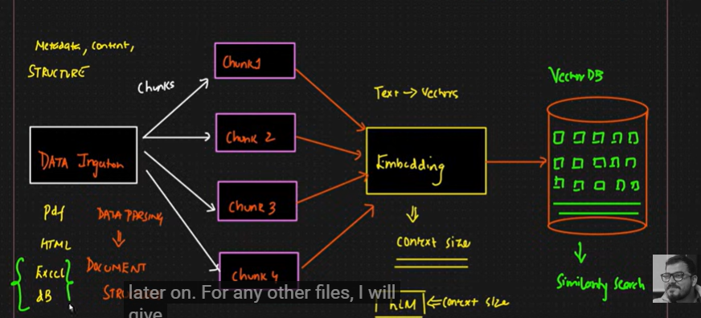
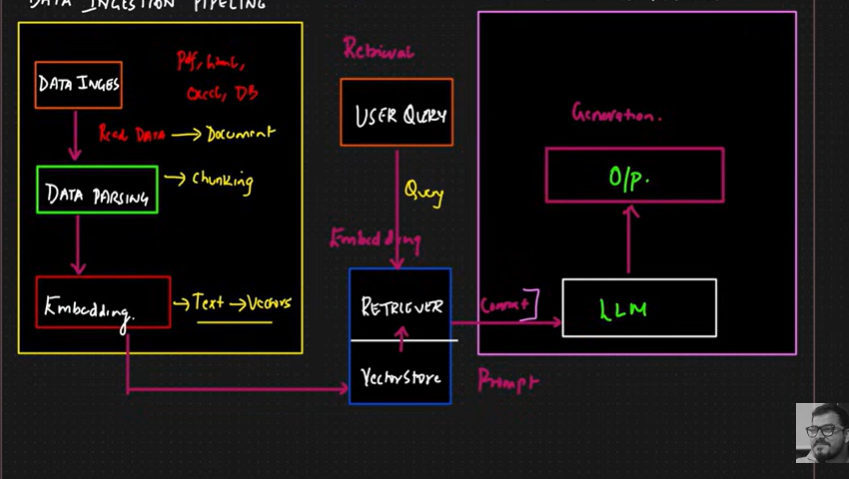
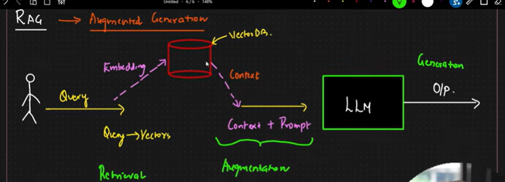

A LangChain `Document` has 2 main parts 📄

1. **page_content** → actual text/content

```python id="q3yk4n"
page_content = "RAG is a technique..."
```

2. **metadata** → extra info about the document

```python id="n0c6dz"
metadata = {
   "source": "chapter1.pdf",
   "page": 5
}
```

In RAG:

```text id="gctnmg"
PDF → Chunks → Document Objects → Embeddings → Vector DB
```

- `page_content` is embedded and searched
- `metadata` helps in filtering and tracking documents 🚀

**Document loaders** are used to load data from different sources into LangChain.

Common Loaders 🚀
PyPDFLoader → load PDFs
CSVLoader → load CSV files
WebBaseLoader → load website content
DirectoryLoader → load all files from a folder

### Retriever

A retriever is basically an abstraction/interface over the vector store that handles retrieval logic for you.

Instead of manually doing:

```python id="mrk5w2"
query → embedding → similarity search
```

you just do:

```python id="twb3f4"
retriever.get_relevant_documents(query)
```

Internally the retriever:

1. converts query into embedding
2. performs similarity search on vector DB
3. returns relevant documents

So you can think of it like:

```text id="y7z3ka"
User Query
    ↓
Retriever
    ↓
Vector Store Search
    ↓
Relevant Documents
```

The retriever itself usually does not store data — the vector store does that.
Retriever mainly provides a cleaner retrieval API 🚀





```python
context = "\n\n".join([doc['content'] for doc in results])
```

### Example

If:

```python
results = [
    {'content': 'Python is easy to learn.'},
    {'content': 'Python is used in AI.'},
    {'content': 'Python supports automation.'}
]
```

Then:

```python
context = "\n\n".join([doc['content'] for doc in results])
print(context)
```

### Output

```text
Python is easy to learn.

Python is used in AI.

Python supports automation.
```
